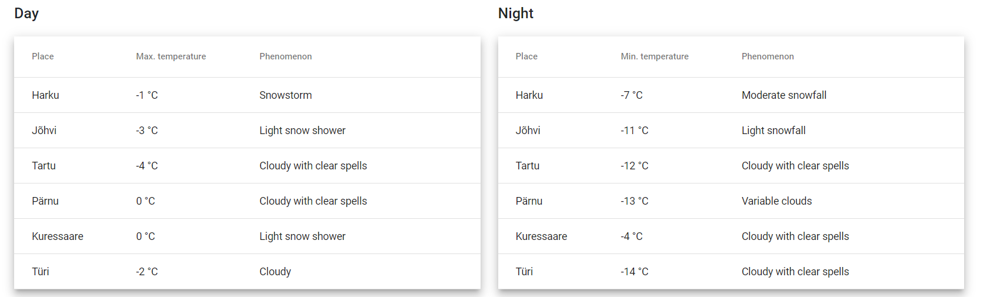

# WeatherForecast front-end

This is front-end part of my trial internship project: Weather forecast web app.

This project is implemented on TypeScript using Angular framework version 13.1.2.

For styling, I used Angular Material and Bootstrap.

### Development server

Run `ng serve` for a dev server. Navigate to `http://localhost:4200/`. The app will automatically reload if you change any of the source files.

### Build

Run `ng build` to build the project. The build artifacts will be stored in the `dist/` directory.

### Back-end
Back-end part of this project can be found here:
[Weather Forecast Back-end](https://github.com/arparn/weather_forecast)

# User guide

### Functionality

- At the top of the web page user can select date (1) or use arrows (2)
to change the weather forecasts.

- Next there are two weather info tabs. User can click on them to read 
detailed weather information about the selected day.

- At the bottom of the web page there are two tables with weather forecasts
for different places. (NB! Not all dates have weather forecasts for places!
In those cases tables with places are absent.)

- The application automatically updates weather data every 2 minutes, so if
the weather data was recently changed the user will always see the latest forecasts with no
need of web page reloading.
- If an error occurred, the application will continue running with empty data
and user will see an error message until the proper response is received.

